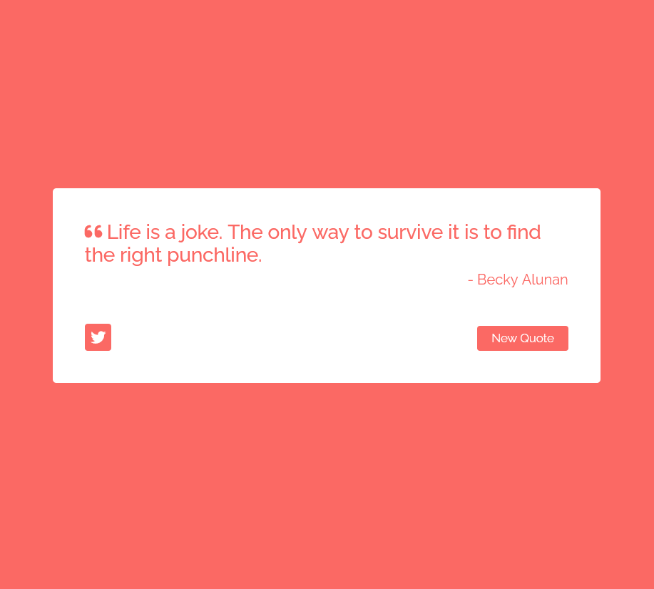

# freeCodeCamp - Front End Development Libraries Projects

This is a solution to the [Build a Random Quote Machine](https://www.freecodecamp.org/learn/front-end-development-libraries/front-end-development-libraries-projects/build-a-random-quote-machine). 

## Table of contents

  - [The challenge](#the-challenge)
  - [Screenshot](#screenshot)
  - [Links](#links)
- [My process](#my-process)
  - [Built with](#built-with)
  - [What I learned](#what-i-learned)
- [Author](#author)
- [Acknowledgments](#acknowledgments)

### The challenge

Build a Random Quote Machine

You can use any mix of HTML, JavaScript, CSS, Bootstrap, SASS, React, Redux, and jQuery to complete this project. You should use a frontend framework (like React for example) because this section is about learning frontend frameworks.

Full instructions and user stories [here.](https://www.freecodecamp.org/learn/front-end-development-libraries/front-end-development-libraries-projects/build-a-random-quote-machine)

### Screenshot

### Links

- Solution URL: [GitHub](https://github.com/ivelinsm/quotes)
- Live Site URL: [Netlify](https://tender-johnson-2e114b.netlify.app/)

## My process

  1. Started with the HTML and for the first time I tried to follow the BEM methodology, although the challenge is small and its structure is simple.
  2. Looked through both versions to take some notes for the CSS part and decided to use both Grid and Flex.
  3. Wrote the code.

### Built with

- Semantic HTML5 markup
- Flexbox
- Mobile-first workflow
- React

### What I learned

I had tons of problems as this was my first project of 5 to finish the Front End Development Libraries Course on freeCodeCamp

1. The biggest challenge was to get the quotes. There was an easy approach to the problem using an array of hard-coded quotes or using the api once to get multiple quotes and assign them to an array, but I decided to do it a little bit harder and make a request everytime the "New Quote" button is pressed. This way I practiced working with apis more.

2. I learned more about Axios and feel well prepared to use it in future projects.

3. The third challenge was to make the "Share" button, because this was my first time using such a button. 

4. Gained more knowledge about the overall process of making a react app. Deciding how many components to make and what exactly to include in each of them and why. 

## Author

- Github - [ivelinsm](https://github.com/ivelinsm)
- freeCodeCamp - [@ivelinsm](https://www.freecodecamp.org/fcc927d30f9)

## Acknowledgments

I would like to thank the whole freeCodeCamp community for the awesome and fun challenge.